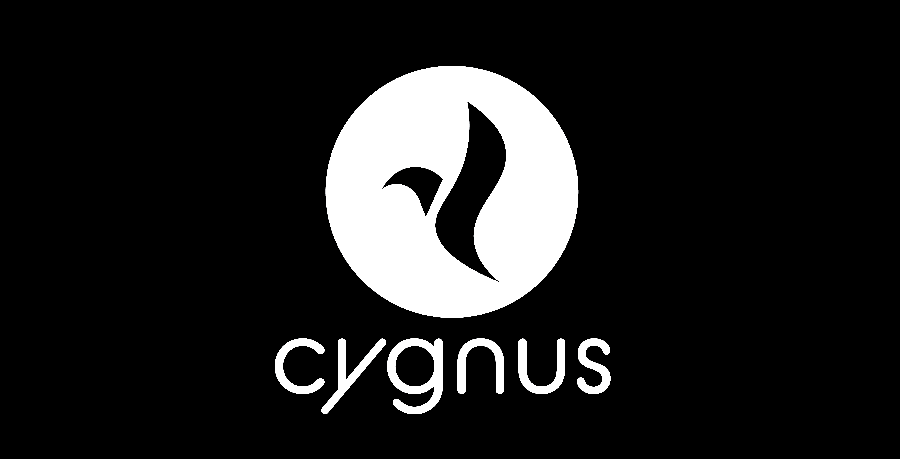

<p align="center">
 
</p>

# CygnusOS CAF

CygnusOS CAF is a minimal custom Android ROM which provides users best UI and performance altogether.

## Getting source code

First, make sure you have an [Android build environment](https://source.android.com/setup/build/initializing) and the [repo tool](https://source.android.com/setup/build/downloading) set up. After that, run the following commands:

```bash
repo init -u https://github.com/cygnus-rom/manifest -b caf-12
```
```bash
repo sync -c --force-sync --optimized-fetch --no-tags --no-clone-bundle --prune -j$(nproc --all)
```

This is a large download that will take approximately 100 GB of disk space, so plan accordingly.

## Finally to build

```bash
  . b*/e*
  lunch cygnus_device_codename-userdebug
  make cygnus -j$(nproc --all)
```
## ADDITIONAL INFORMATION

Since Cygnus doesn't have pathmaps, you need to have your own HALs. You can take HALs from any ROM provided they build fine and don't have any pathmaps in them.
The paths for cloning HALs are as follows:

Audio -> ```vendor/qcom/opensource/audio-hal/primary-hal```

Media -> ```hardware/qcom/media```

Display -> ```hardware/qcom/display```

Of course, many HALs can be found in our devices org, on their respective caf-12-x branches and you can use them if your device has the same chipset, Happy Compiling!

## Report build issues
You can reach us via [Telegram](https://t.me/CygnusOS)

## Credits

* [**CAF**](https://source.codeaurora.org)
* [**AOSPA**](https://github.com/aospa/)
* [**LineageOS**](https://github.com/LineageOS)

And all others we might've missed out


